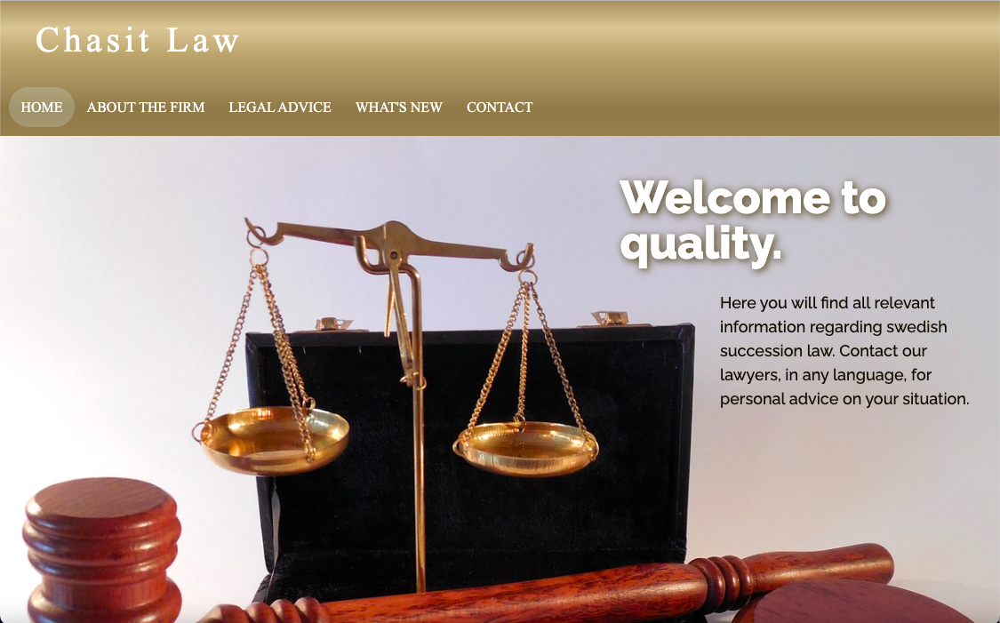
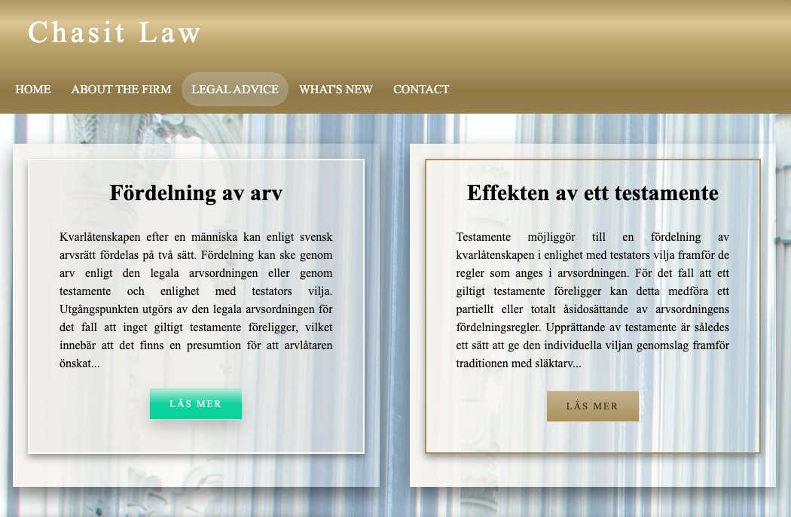
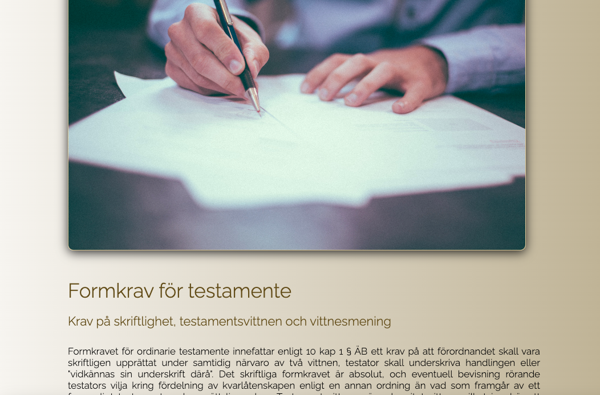
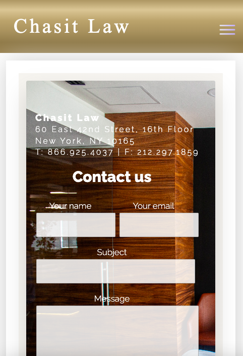

# Swedish Succession Law Guide
 
[Link to published site](https://annaaxelsson051.github.io/Swedish-Succession-Law-Guide/)

## User Interface

---

## Description

An informative law webpage that allows users to find comprehensive information about Swedish succession law with legal references, providing an efficient cost-free solution for legal information needs. The webpage is responsive on mobile, tablets and larger screens. 

The objective was to create a public service platform that offers well-referenced content, simplifying the process of accessing valuable and relevant legal information eliminating the need to navigate complex laws and precedents.

---

## Technologies used:

- HTML
- CSS
- Vanilla JavaScript
- Responsivity
- Animations
- Grids

---

## More UI

